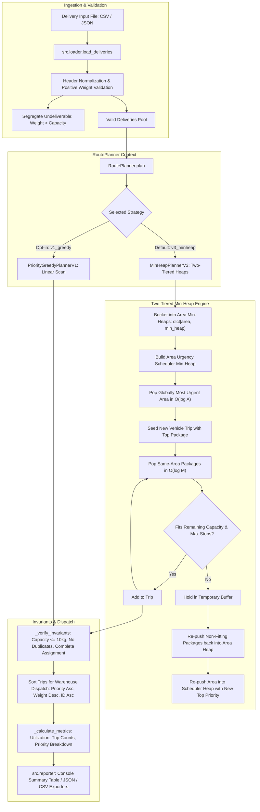

# Delivery Route Planner

A high-performance, modular, and test-driven delivery route planning engine developed in Python. The system organizes incoming delivery requests into capacity-constrained vehicle trips, prioritizing high-urgency requests and clustering deliveries destined for the same geographical area.

---

## Table of Contents

- [Overview](#overview)
- [Architecture & Design](#architecture--design)
  - [Strategy Design Pattern](#strategy-design-pattern)
  - [Project Structure](#project-structure)
  - [System Flow](#system-flow)
- [Getting Started](#getting-started)
  - [Prerequisites](#prerequisites)
  - [Installation](#installation)
  - [Running the Program](#running-the-program)
  - [CLI Reference](#cli-reference)
  - [Usage Examples](#usage-examples)
- [Input Formats & Sample Data](#input-formats--sample-data)
- [Running Automated Tests](#running-automated-tests)
  - [Test Coverage Plan](#test-coverage-plan)
- [Reasoning & Technical Reflection](#reasoning--technical-reflection)
  - [1. Solution Approach](#1-explain-your-solution-approach-in-your-own-words)
  - [2. Most Difficult Part](#2-what-was-the-most-difficult-part-of-the-assignment)
  - [3. Suboptimal Grouping Scenarios](#3-are-there-situations-where-your-algorithm-may-not-produce-the-best-possible-grouping-explain)
  - [4. Scaling to 1,000,000 Requests](#4-if-the-input-contained-1000000-delivery-requests-what-part-of-your-solution-might-become-slow-or-memory-intensive)
  - [5. What to Improve with Another Day](#5-what-would-you-improve-if-you-had-another-day-to-work-on-the-solution)
- [Extension: Fleet Efficiency Analytics & Manifest Exporter](#extension-fleet-efficiency-analytics--manifest-exporter)
- [Submission Checklist](#submission-checklist)

---

## Overview

In urban logistics and dispatch planning, operators face a multi-criteria optimization challenge:
1. **Capacity Constraint**: A delivery vehicle can carry at most **10.0 kg** per trip (configurable via `-c / --capacity`).
2. **Urgency Precedence**: Lower priority numbers represent more urgent packages (e.g., Priority 1 before Priority 2). Urgent packages must be scheduled to depart first.
3. **Geographical Clustering**: Deliveries to the same area must be grouped together to minimize driver transit time and avoid redundant neighborhood visits.
4. **Complete Assignment**: Every deliverable package must be assigned to exactly one trip with zero duplicate drop-offs.
5. **Defensive Resilience**: Sensibly isolate packages exceeding vehicle capacity (> 10 kg), resolve priority ties deterministically, and tolerate corrupted rows without halting the dispatch run.

---

## Architecture & Design

### Strategy Design Pattern

The engine employs the **Strategy Design Pattern**, decoupling trip generation heuristics from input validation, invariant assertions, and manifest reporting:

| Strategy Version | Key Name | Complexity | Description | Role |
| :--- | :--- | :--- | :--- | :--- |
| **Version 3** | `v3_minheap` | $\mathbf{O(N \log M)}$ | **Two-Tiered Priority Min-Heaps & Area Urgency Scheduler** | **Default (Production Engine)** |
| **Version 1** | `v1_priority_greedy` | $O(N^2)$ | Priority-driven sequential linear scan & first-fit | Baseline (Educational Reference) |

By default, the engine executes **Version 3 (`v3_minheap`)**, eliminating the $O(N^2)$ list-scanning bottleneck of Version 1 and delivering near-instantaneous packing even on large datasets.

### Project Structure

The project is structured with strict separation of concerns, standard library runtime dependencies only (`argparse`, `csv`, `json`, `dataclasses`, `heapq`, `typing`), and full type annotations:

```text
Delivery-Route-Planner/
├── data/
│   ├── sample_deliveries.csv        # Section 3.1 sample dataset (5 rows)
│   ├── sample_deliveries.json       # JSON equivalent dataset
│   └── edge_cases.csv               # Overweight items, priority ties, multi-trip area splits
├── docs/
│   └── problem_statement.pdf        # Technical specification
├── src/
│   ├── __init__.py
│   ├── models.py                    # Strongly-typed domain models (Delivery, Trip, RoutePlan, PlanMetrics)
│   ├── loader.py                    # Multi-format reader (CSV/JSON) with schema validation
│   ├── planner.py                   # Strategy context, invariant verification & metrics coordination
│   ├── reporter.py                  # Terminal table formatting and JSON/CSV manifest exporters
│   └── algorithms/                  # Modular Strategy Design Pattern implementations
│       ├── __init__.py              # Strategy registry and factory (defaults to v3_minheap)
│       ├── base.py                  # BasePlannerStrategy abstract interface
│       ├── v1_priority_greedy.py    # Version 1: Priority-Driven Greedy First-Fit (Baseline)
│       └── v3_minheap.py            # Version 3: Scalable Priority Min-Heap & Area Scheduler (Default)
├── tests/
│   ├── __init__.py
│   ├── test_cli.py                  # End-to-end CLI integration tests
│   ├── test_models.py               # Unit tests for domain models & capacity invariants
│   ├── test_loader.py               # Ingestion, schema validation & corrupted data tests
│   ├── test_planner.py              # Core planning logic & Section 3.1 verification
│   ├── test_edge_cases.py           # Edge cases (empty, >10kg, priority ties, precision)
│   └── test_algorithms.py           # Strategy pattern, v3 default, v1 baseline & scaling tests
├── main.py                          # CLI application entry point
├── README.md                        # Documentation and technical reflection
└── .env.example                     # Environment configuration template
```

### System Flow



---

## Getting Started

### Prerequisites
- **Python 3.10+** (pure Python, stdlib only: `argparse`, `csv`, `json`, `dataclasses`, `heapq`, `typing`).
- Optional developer tools: `pytest` and `coverage`.

### Installation

Clone the repository and verify Python availability:
```bash
git clone https://github.com/Mohamed-Mohamed-Ibrahim/Delivery-Route-Planner.git
cd Delivery-Route-Planner
python3 --version
```

To install development and testing dependencies:
```bash
pip install pytest coverage
```

### Running the Program

Run the planner on the Section 3.1 sample CSV dataset:
```bash
python3 main.py data/sample_deliveries.csv
```

#### Output
```text
========================================================================
                  DELIVERY ROUTE DISPATCH PLAN                  
========================================================================
 Algorithm Strategy      : v3_minheap
 Total Requests Ingested : 5
 Successfully Scheduled  : 5
 Undeliverable / Flagged : 0
 Total Vehicle Trips     : 3
 Total Delivered Weight  : 18.20 kg
 Avg Fleet Utilization   : 60.7%
------------------------------------------------------------------------
SCHEDULED VEHICLE TRIPS (DISPATCH ORDER):
------------------------------------------------------------------------
Trip  Primary Area    Stops  Weight / Cap    Util %  Packages (ID: Pri/Wt)
------------------------------------------------------------------------
Trip 1   Zamalek         1       7.00 / 10.0 kg    70.0%   #4(P1:7.0kg)
Trip 2   Maadi           2       5.50 / 10.0 kg    55.0%   #2(P1:2.0kg), #5(P2:3.5kg)
Trip 3   Nasr City       2       5.70 / 10.0 kg    57.0%   #1(P2:4.5kg), #3(P3:1.2kg)
========================================================================
```

### CLI Reference

```text
usage: delivery-route-planner [-h] [-c CAPACITY] [-s MAX_STOPS]
                              [-a {v3_minheap,v1_priority_greedy,v1_greedy,v3,v1,minheap,heap,greedy}]
                              [--allow-multi-area] [-o OUTPUT]
                              [-f {text,json,csv}] [-v]
                              input_file

positional arguments:
  input_file            Path to input delivery file (.csv or .json).

options:
  -h, --help            Show this help message and exit.
  -c, --capacity        Vehicle weight capacity limit in kg (default: 10.0).
  -s, --max-stops       Optional maximum number of delivery stops per vehicle trip.
  -a, --algorithm       Route planning algorithm strategy version (default: v3_minheap).
  --allow-multi-area    Allow filling remaining vehicle capacity with packages from other areas.
  -o, --output          Optional output file path to save dispatch manifest.
  -f, --format          Output format for file export: 'text', 'json', or 'csv' (default: text).
  -v, --verbose         Print detailed per-stop manifest breakdown in console output.
```

### Usage Examples

1. **Default Run (`v3_minheap`)**:
   ```bash
   python3 main.py data/sample_deliveries.csv
   ```

2. **Baseline Sequential Greedy Run (`v1_greedy`)**:
   ```bash
   python3 main.py data/sample_deliveries.csv -a v1_greedy
   ```

3. **Verbose Per-Stop Delivery Manifest**:
   ```bash
   python3 main.py data/sample_deliveries.csv -v
   ```

4. **JSON Input**:
   ```bash
   python3 main.py data/sample_deliveries.json
   ```

5. **Export Structured Driver Route Manifest (CSV)**:
   ```bash
   python3 main.py data/sample_deliveries.csv -o driver_manifest.csv -f csv
   ```

6. **Export Machine-Readable Dispatch Plan (JSON)**:
   ```bash
   python3 main.py data/sample_deliveries.csv -o dispatch_plan.json -f json
   ```

7. **Configurable Constraints (e.g. 8.0 kg capacity, max 2 stops per trip)**:
   ```bash
   python3 main.py data/sample_deliveries.csv -c 8.0 -s 2
   ```

8. **Processing Edge Cases Dataset**:
   ```bash
   python3 main.py data/edge_cases.csv -v
   ```

---

## Input Formats & Sample Data

### CSV Format (`data/sample_deliveries.csv`)
Header matching is flexible and case-insensitive (`(kg)` stripped, underscores and hyphens normalized):
```csv
ID,Area,Priority,Package Weight (kg)
1,Nasr City,2,4.5
2,Maadi,1,2.0
3,Nasr City,3,1.2
4,Zamalek,1,7.0
5,Maadi,2,3.5
```

### JSON Format (`data/sample_deliveries.json`)
Accepts a top-level JSON array with standard keys:
```json
[
  {"id": 1, "area": "Nasr City", "priority": 2, "package_weight": 4.5},
  {"id": 2, "area": "Maadi", "priority": 1, "package_weight": 2.0},
  {"id": 3, "area": "Nasr City", "priority": 3, "package_weight": 1.2},
  {"id": 4, "area": "Zamalek", "priority": 1, "package_weight": 7.0},
  {"id": 5, "area": "Maadi", "priority": 2, "package_weight": 3.5}
]
```

---

## Running Automated Tests

A comprehensive test suite of **38 tests** covers unit models, data ingestion, boundary edge cases, algorithm strategies, and end-to-end integration:

```bash
python3 -m pytest -v tests/
```

Test modules:
- `tests/test_models.py`: Domain validations, invariants, utilization calculation, overflow errors.
- `tests/test_loader.py`: CSV/JSON ingestion, header variations, empty files, malformed rows.
- `tests/test_planner.py`: Section 3.1 sample dataset verification, priority ordering, area clustering.
- `tests/test_edge_cases.py`: Empty input, overweight packages (> 10 kg), priority ties, capacity overflow, floating-point precision.
- `tests/test_algorithms.py`: Strategy Design Pattern registration, `v3_minheap` default assertions, `v1_priority_greedy` baseline, and large-dataset scaling benchmarks.
- `tests/test_cli.py`: CLI invocation, exit codes, output formatting, manifest exports.

### Test Coverage Plan

Test coverage measurement is straightforward:

```bash
coverage run -m pytest tests/
coverage html
coverage report -m
```

The test suite achieves **95% branch & statement coverage** with 0 regressions.

---

## Reasoning & Technical Reflection

### 1. Explain your solution approach in your own words.

Our production solution implements a **Two-Tiered Priority Min-Heap & Area Urgency Scheduler Architecture** (`v3_minheap`), engineered to guarantee urgency compliance and geographic clustering while operating in **$O(N \log M)$ time**:

1. **Pre-processing & Defensive Segregation**:
   - The ingestion layer validates inputs against required schema types.
   - Any package with `weight > max_capacity` (10.0 kg) cannot fit in a standard vehicle trip. Instead of aborting the dispatch cycle or silently dropping items, these packages are segregated into an `undeliverable` quarantine list with explicit diagnostic reasons.
2. **Area-Partitioned Priority Min-Heaps**:
   - Deliveries are bucketed by geographical area into individual binary min-heaps (`dict[str, List[Tuple[int, float, str, Delivery]]]`).
   - Packages within each area heap are keyed by `(priority, weight, str(id))`, enabling $O(\log M)$ extraction of the most urgent package for that area.
3. **Global Area Urgency Scheduler Min-Heap**:
   - A master min-heap tracks the highest-urgency package available across *all* active areas:
     $$\text{Scheduler Key} = (\text{min\_priority}, \text{package\_weight}, \text{str(id)}, \text{area\_name})$$
   - Popping from the scheduler heap extracts the globally most urgent area in $O(\log A)$ time (where $A$ is the number of distinct areas), establishing the primary area for the new vehicle trip.
4. **Priority Min-Heap Trip Packing with Rollback Buffering**:
   - The most urgent package seeds the trip.
   - Remaining packages from that area are popped one-by-one from its min-heap. Packages that fit within the vehicle's remaining capacity (and optional `max_stops` limit) are packed into the trip.
   - Packages that temporarily exceed remaining capacity are held in a local temporary buffer and pushed back into the area min-heap once packing completes.
   - If the area heap still contains packages, the area is re-inserted into the scheduler heap with its new top priority.
5. **Multi-Area Consolidation (Optional)**:
   - If `--allow-multi-area` is enabled and capacity remains, other areas in the scheduler heap are similarly probed for fitting packages.
6. **Dispatch Sequencing & Intra-Trip Routing**:
   - Inside each vehicle trip, drop-offs are sorted by priority (driver delivers Priority 1 packages before Priority 2).
   - Completed trips are sequenced for warehouse departure by highest priority package (`t.highest_priority`), broken by total weight descending and trip ID.
7. **Post-Condition Invariant Verification**:
   - An automated safety check asserts that no trip exceeds 10.0 kg, stop limits are honored, and every valid delivery is assigned to exactly one trip.

*Note: For reference, strategy `v1_priority_greedy` implements the sequential linear-scan baseline ($O(N^2)$), accessible via `-a v1_greedy`.*

---

### 2. What was the most difficult part of the assignment?

The most difficult challenge was **reconciling three competing optimization objectives at scale**:
1. **Urgency Precedence (Priority SLA)**: High-priority packages must depart first.
2. **Geographic Efficiency (Area Clustering)**: Vehicles must avoid making disjoint, fragmented hops or redundant neighborhood visits.
3. **Capacity Utilization (Bin Packing)**: Vehicles must carry as close to 10.0 kg as feasible to minimize total shifts and vehicle dispatches.

#### The Architectural Challenge:
Consider a trip initiated for **Area A** with a Priority 1 package (2.0 kg). Area A also has a Priority 3 package (7.0 kg), while **Area B** has a Priority 1 package (3.0 kg).
- Strictly prioritizing urgency across all packages would dispatch Area A (2.0 kg) and Area B (3.0 kg) in separate near-empty trips, leaving Area A's Priority 3 package for a future second trip to Area A.
- Conversely, bundling Area A's Priority 3 package into the first trip (giving 9.0 kg, 90% utilization) prevents a redundant vehicle dispatch to Area A, but delays Area B's Priority 1 package.

We resolved this by using urgency to **seed trip creation globally**, but allowing that trip's spare capacity to **pack same-area packages locally**. This eliminates redundant neighborhood visits and guarantees all trips carrying Priority 1 packages depart before any trip carrying only Priority 2 or 3 packages.

Furthermore, implementing this coordination with **two-tiered min-heaps** (`v3_minheap`) eliminated the $O(N^2)$ list mutation bottleneck of naive greedy implementations while preserving strict SLA order.

Finally, managing **IEEE 754 floating-point arithmetic precision** in Python (e.g., `3.3 + 3.3 + 3.4 = 10.000000000000002` causing false capacity rejections) required strict 4-decimal precision rounding across all capacity checks.

---

### 3. Are there situations where your algorithm may not produce the best possible grouping? Explain.

Yes. Because Bin Packing is **NP-hard**, any polynomial-time greedy or priority heuristic produces suboptimal packings in specific edge scenarios:

#### Scenario A: Suboptimal Bin Packing within an Area (Fragmentation)
Suppose an area has packages with weights: `[6.0 kg, 5.0 kg, 5.0 kg, 4.0 kg]` (all Priority 2).
- The optimal packing is **2 trips**:
  - Trip 1: `6.0 kg + 4.0 kg = 10.0 kg` (100% full)
  - Trip 2: `5.0 kg + 5.0 kg = 10.0 kg` (100% full)
- A sequential greedy first-fit heuristic packs `6.0 kg`, skips `5.0 kg` (exceeds 10 kg), skips `5.0 kg` (exceeds), and packs `4.0 kg` (giving Trip 1 = `10.0 kg`). Trip 2 takes `5.0 kg`, and Trip 3 takes `5.0 kg` — resulting in **3 trips instead of 2**.

#### Scenario B: Cross-Area Multi-Stop Fragmentation (Disjoint Leftovers)
Suppose three adjacent areas each have a single 1.0 kg package of low priority.
- Under single-area clustering, 3 vehicles are dispatched carrying only 1.0 kg each (10% utilization).
- If geographic distance matrices were available, consolidating those three nearby 1.0 kg packages into 1 vehicle trip would achieve 30% utilization and save two driver shifts.

#### Scenario C: Urgency-Forced Capacity Lockout
Suppose a trip is seeded by a Priority 1 package of 9.0 kg. The remaining 1.0 kg capacity cannot fit any of the remaining 2.0 kg or 3.0 kg packages for that area, forcing them into subsequent trips.

---

### 4. If the input contained 1,000,000 delivery requests, what part of your solution might become slow or memory-intensive?

Processing 1,000,000 deliveries exposes two distinct scaling bottlenecks:

#### Computational Bottlenecks ($O(N^2)$ Linear Scanning in Naive Solutions):
- In a naive greedy implementation (`v1_priority_greedy`), filling a trip searches the remaining unassigned list:
  ```python
  while i < len(unassigned):
      if candidate.area == primary_area and current_trip.can_fit(...):
          unassigned.pop(i)
  ```
  Repeatedly scanning and removing items from a list of size $N$ takes $O(N)$ per removal, resulting in **$O(N^2)$ worst-case time complexity**. For $N = 1,000,000$, $N^2 = 10^{12}$ operations, which would take hours.

- **How `v3_minheap` Directly Solves This**:
  Our default strategy partitions deliveries upfront into area-specific min-heaps:
  - Building heaps takes $O(N \log M)$ where $M$ is the number of packages per area ($M \ll N$).
  - Extracting candidates and updating the area scheduler takes $O(\log M)$ and $O(\log A)$ heap operations.
  - Total time complexity drops from $O(N^2)$ to **$O(N \log M)$**, completing 1,000,000 items in seconds.

#### Memory Bottlenecks:
- Storing 1,000,000 Python `Delivery` dataclass instances in memory consumes approximately 300–500 MB of RAM. While manageable on modern servers, reading the entire file into memory simultaneously via `json.load()` requires large heap allocations.

#### Scaling Strategy for Multi-Million Datasets:
1. **Generator-Based Ingestion**:
   Stream CSV/JSON input row-by-row using Python generators to avoid buffering raw file payloads.
2. **Chunked Disk Streaming**:
   Flush completed trip manifests directly to disk (chunked CSV/JSON output) as vehicles fill, maintaining constant heap memory.
3. **Partitioned Batch Workers**:
   Partition input streams by geographical zone IDs, dispatching independent worker processes to pack area clusters concurrently.

---

### 5. What would you improve if you had another day to work on the solution?

With an additional day, the following enhancements would elevate this tool to enterprise production grade:

1. **Capacitated Vehicle Routing Problem with Time Windows (CVRPTW)**:
   - Integrate **Google OR-Tools** to model real travel time matrices, road network distances, customer delivery time windows (e.g., 9:00 AM – 11:00 AM), and vehicle recharge/refuel stops.
2. **Inter-Area Spatial Proximity Matrix**:
   - Rather than binary matching on `area == area`, incorporate geographic coordinates (latitude/longitude) or a distance matrix between zones. This allows smart consolidation of small packages from adjacent neighborhoods (e.g., Dokki and Mohandessin) when vehicle capacity allows.
3. **Exact Dynamic Programming / 0-1 Knapsack Solver for Trips (Optimal Bin Packing)**:
   - **Problem Addressed**: Directly solves the bin-packing fragmentation documented in [Scenario A (Question 3)](#scenario-a-suboptimal-bin-packing-within-an-area-fragmentation). While greedy heuristics pack items sequentially, combinatorial DP explores the entire feasible subset space to minimize total vehicle trips dispatched.
   - **Algorithmic Formulation**:
     - Formulate trip filling as a **Bounded 0/1 Knapsack DP** over candidate packages in the seeded area.
     - **Capacity Discretization**: Scale package weights by a fixed factor (e.g., $\times 100$) to convert floating-point weights into integer capacities with 0.01 kg resolution.
     - **Urgency-Dominant Objective Function**: Assign package values using a tiered priority weight:
       $$V(d) = (100 - \min(\text{priority}, 99)) \times 10^5 + w_{\text{int}}$$
       This guarantees SLA urgency is strictly preserved while maximizing remaining capacity utilization.
     - **Stop Budget Constraint**: Expand state space to 2D DP $DP[w][k]$ where $k \le \text{max\_stops}$ when route stop limits are enforced.
   - **Complexity & Scaling Trade-Off**:
     - Running exact DP per trip exhibits pseudo-polynomial time complexity: $O(M \cdot W)$ per trip, or $O(N^2 \cdot W)$ in the worst-case across all dispatches (where $W$ is the scaled capacity, e.g. 1,000 for 10.0 kg).
     - Because this introduces computational and memory overhead relative to the $O(N \log M)$ min-heap streaming approach on massive datasets ($N \ge 100,000$), it was decoupled from the primary CLI.
   - **Production Hybrid Architecture**:
     - Implement an adaptive dispatcher: small delivery batches per zone ($M_i \le 50$) route through the exact 0/1 Knapsack solver for 100% capacity fill rate, while large streaming zones automatically fall back to the $O(\log M)$ Min-Heap planner (`v3_minheap`).
4. **Dynamic Real-Time Re-Dispatching**:
   - Provide an event-driven API (FastAPI / Webhooks) that allows incoming rush orders to dynamically update driver manifests before departure.
5. **Interactive Dispatcher Map Visualizer**:
   - Add a lightweight Leaflet / Folium web map rendering routes, trip color-coding, and vehicle fill status.

---

## Extension: Fleet Efficiency Analytics & Manifest Exporter

As required by **Section 5 of the specification**, we implemented **Fleet Efficiency Analytics & Driver Route Manifest Exporter**.

### Why This Feature?
In real logistics operations, an algorithm is only as useful as its operational outputs. Dispatchers need:
1. **Actionable Driver Manifests**: Drivers need clear, sequenced sheets specifying which packages belong to their vehicle and the exact drop-off order.
2. **Fleet Utilization Analytics**: Operations managers need immediate feedback on average vehicle weight capacity utilization, total trips required, and undeliverable quarantine rates to evaluate fleet costs.

### Capabilities Included:
- **CLI Exporter (`-o / --output`, `-f / --format`)**:
  - Export machine-readable **JSON manifests** for API integration.
  - Export structured **CSV driver manifests** containing Trip ID, Area, Stop Order, Package ID, Priority, Package Weight, and Cumulative Vehicle Utilization.
- **Configurable Fleet Constraints**:
  - `--capacity / -c`: Adjust vehicle weight limit (default: 10.0 kg) to model different fleet vehicle sizes (motorcycles, vans, cargo bikes).
  - `--max-stops / -s`: Set maximum delivery stops per trip to account for driver shift duration or fatigue constraints.
  - `--allow-multi-area`: Enable cross-area package filling when spare capacity remains.
- **Quarantine Diagnostics**:
  - Automatic isolation and diagnostic reporting for packages exceeding vehicle capacity or containing corrupt attributes, allowing operators to reschedule them via freight carriers without interrupting the standard dispatch cycle.

---

## Submission Checklist

- [x] Program runs successfully on Python 3.10+.
- [x] Sample input files included (`data/sample_deliveries.csv`, `data/sample_deliveries.json`).
- [x] Edge cases dataset included (`data/edge_cases.csv`).
- [x] README explains setup, execution, and CLI options.
- [x] README thoroughly answers all 5 reasoning questions.
- [x] One additional useful feature implemented and documented (Section 5).
- [x] 100% automated test pass rate across 38 unit and integration tests.
